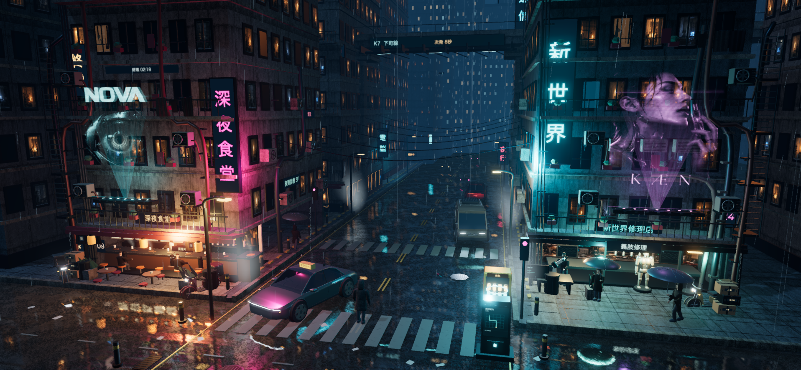

# AFTERLIGHT — District 09

An original Three.js cyberpunk neighborhood at 02:13: rain, translucent holographic advertising, a late-night noodle bar, a cybernetics workshop, and an elevated metro. The street carries on without asking the visitor to trigger it.



## Public site

[Explore Afterlight](https://afterlight-cyberpunk.nickfromlater.chatgpt.site) · [Source on GitHub](https://github.com/nickfromlater/afterlight). The hosted city includes all models and audio; it does not depend on the local Mac.

For Sites updates, `npm run build:sites` retains the normal LAN build and stages a Worker plus static assets in `.sites-build`. Package that directory with the Sites hosting helper. The project binding is in `.openai/hosting.json`.

## Run locally

```sh
git clone https://github.com/nickfromlater/afterlight.git
cd afterlight
npm ci
npm run build
npm run serve
```

The production server binds `0.0.0.0:4173`. Open `http://<this-Mac-LAN-IP>:4173` from another device on the same network while this Mac is awake. The detached process logs to `.dream-loop/server.log`; its PID is in `.dream-loop/server.pid`. Restart with `npm run serve` after a reboot. Development: `npm run dev` on port 5173.

Requires Node.js 20.19+ or 22.12+; built with Node 24.

## Explore

Click the street to walk, drag to look around, and scroll to zoom. On touch devices, tap, drag, and pinch. The courier routes around parked vehicles and street equipment. **R** resets the view and position; **H** hides the remaining controls; **Escape** reveals them. The small control strip fades after inactivity. Quality: light lowers rendering cost; touch devices start in this mode with a wider view.

There are no action panels, floating hotspots, pickup counters, advertising hacks, proximity prompts, or mission-like interactions.

## Neighborhood life

- Eight independently animated residents: three pedestrians on pavement routes, two seated diners, a cook, a technician, and a neighbor sheltering from the rain. Pedestrians pause along their routes and yield when the courier is close. Original skinned models have short jackets, hooded coats, or a kitchen apron, with individual clothing colors, gait timing, and gestures.
- Diners raise cups, the cook stirs, and the repair arm runs an ongoing alignment/inspection sequence beside the technician.
- Traffic approaches from the distance and turns into the service alley. The parked taxi sweeps its windshield intermittently; the elevated train brings moving light through the street.
- Pleated noren, laundry, and curtains move in the wind. Four upper rooms contain subtle moving silhouettes and changing light.
- Water drains from six awning/downspout outlets into local ripples. Small plumes rise from food and kitchen surfaces; wind stirs scraps along the curb.
- The large advertisements remain translucent holograms with scan lines, shallow curvature, displaced image layers, and visible projector hardware. The public terminal carries transit information as part of the environment.

## Sound

The city includes 18 original ElevenLabs sound layers: spatial rain/runoff, kitchen and conversation, a quiet shop radio, workshop machinery, passing traffic, metro rumble, and animation-driven Foley. Click/tap the street or select **Enable sound**. **M** toggles mute. Sound pauses in the background; no API key is shipped to browsers. Design and provenance: [docs/SOUND_DESIGN.md](docs/SOUND_DESIGN.md).

## Original assets

The sedan, van, delivery scooter, courier, civilian resident, and service android were modeled in Blender for this project. City architecture, interiors, furniture, fabric effects, screens, and utilities are authored in Three.js. Raster art and surface textures were generated for this project; no stock models or artwork are used.

Sources and image-generation prompts: [docs/ASSETS.md](docs/ASSETS.md). Rebuild models from the project root:

```sh
/Applications/Blender.app/Contents/MacOS/Blender --background --factory-startup --python scripts/build-vehicles.py
/Applications/Blender.app/Contents/MacOS/Blender --background --factory-startup --python scripts/build-scooter.py
/Applications/Blender.app/Contents/MacOS/Blender --background --factory-startup --python scripts/build-humans.py
/Applications/Blender.app/Contents/MacOS/Blender --background --factory-startup --python scripts/build-android.py
```

## Verification and rendering

The project's process, lessons, and reusable workflow are documented in [Afterlight: from a convincing image to a convincing place](docs/workflows/afterlight-process.md). The portable [Dream Loop Production skill](skills/dream-loop-production/SKILL.md) covers art direction, assets, motion, sound, camera capture, verification, and delivery.

`npm test` checks navigation around vehicle footprints, reachability between clear street destinations, and rejection of blocked destinations. Browser/LAN evidence is recorded in [docs/VALIDATION.md](docs/VALIDATION.md).

Residents use continuous skinned surfaces and independent skeletons. Rigid vehicle and android parts are combined by material while transparent glazing stays separate. Rain, kitchen vapor, runoff, and vent plumes use GPU animation; static geometry is grouped by material. Static hologram artwork is uploaded once while scan lines and distortion animate on the GPU. Native-resolution rendering uses FXAA to smooth edges. The wet road uses a 768px planar reflection (512px in light mode), and metals/glass use an environment captured from the actual city. High quality adds half-resolution ambient occlusion for close views. Frame rate depends on device, viewport, browser, and other running applications.
