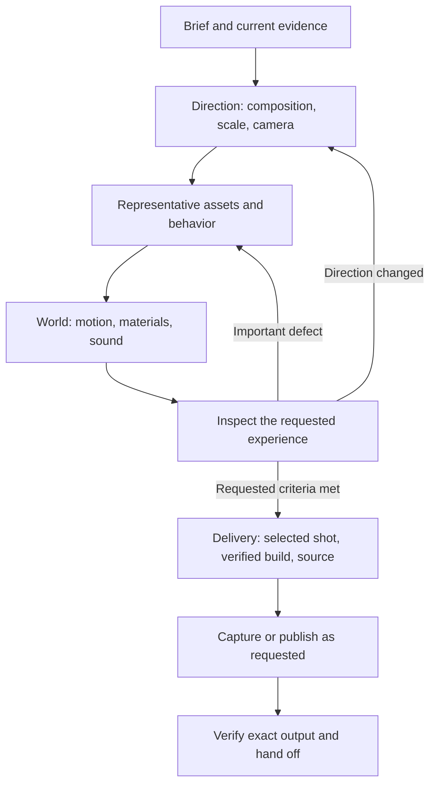

# Afterlight: from a convincing image to a convincing place

This case study records the Afterlight process and proposes a reusable production workflow. It is based on the project source, generation records, validation logs, and user feedback from September 14, 2026. It distinguishes work that shipped from later edits and proposals that were not finished or verified.

The reusable implementation is [Dream Loop Production](../../skills/dream-loop-production/SKILL.md), a companion skill with references for [world building](../../skills/dream-loop-production/references/world-building.md), [camera and capture](../../skills/dream-loop-production/references/camera-and-capture.md), and [verification and delivery](../../skills/dream-loop-production/references/verification-and-delivery.md).

## The central lesson

Dream Loop was effective at establishing a visual direction and pushing beyond a bare prototype. It was less effective at deciding whether the result was a believable interactive world and whether the requested deliverable was actually complete.

Afterlight needed several kinds of fidelity at once: visual composition, plausible objects, continuous movement, coherent environmental sound, responsive exploration, and faithfully framed media. Screenshot similarity covers only part of that problem. The largest process improvement is to make those dimensions explicit and give each the appropriate evidence.

An attractive frame is useful evidence. It cannot tell us whether a pedestrian's elbow separates when seated, a murmur sounds like an unsettling whisper, a camera is on the requested side of the street, or a 60 fps file contains 60 distinct frames per second. We repeatedly encountered those boundaries.

## What we actually built

The application combines authored assets with an interactive renderer. Blender did not render the running city; Three.js did.

| Part | Approach used | Why it fit |
|---|---|---|
| Cars, scooter, people, service android | Original Blender meshes exported to GLB; Python build sources retained | Repeatable mesh construction, named parts, materials, and character rigs |
| Streets, buildings, storefronts, utilities, furniture | Three.js geometry and scene assembly | Fast iteration on layout, scale, repetition, and environment-specific detail |
| Lighting, wet road, holograms, rain, atmosphere | Three.js materials/shaders and postprocessing | Animated effects responding to the actual scene and camera |
| Movement and neighborhood activity | Runtime routes, poses, gestures, cloth/water motion, traffic and train cycles | A world that continues without a sequence of button presses |
| Surface textures and advertising artwork | Generated raster assets, inspected and revised | Rich surface detail without modeling every small feature |
| Sound sources | Eighteen original ElevenLabs generations, prepared locally | Separate environmental and Foley material rather than one fixed soundtrack |
| Runtime sound | Web Audio spatial emitters, attenuation/filtering, loop scheduling, event-driven Foley | Sound attached to streets, shops, vehicles, and animation |
| Delivery | Vite build, LAN serving, Sites hosting, public GitHub repository | A usable local experience, a hosted experience, and shareable source |

Representative implementation: [human construction](../../scripts/build-humans.py), [resident animation](../../src/people.js), [city and signage](../../src/city.js), [hologram rendering](../../src/hologram.js), [spatial mixer](../../src/soundscape.js), and [rigid-model batching](../../src/static-model.js). Asset and sound provenance are recorded in [ASSETS](../ASSETS.md) and [SOUND_DESIGN](../SOUND_DESIGN.md).

## How the project evolved

The brief became clearer through inspection. That is normal for visual work; the workflow should make revisions cheap rather than treating them as disruptions.

1. **Establish a navigable cyberpunk district.** Composition, wet surfaces, lighting, vehicles, and architecture supplied the visual foundation.
2. **Replace generic spectacle with environmental behavior.** The user asked for richer life and fewer gimmicky UX decisions. Action panels, markers, counters, and advertising hacks were removed. Shops, pedestrians, train movement, runoff, curtains, and machinery carried more of the experience.
3. **Make advertisements feel like holographic screens.** Transparency, scan lines, distortion, projection hardware, and scene integration mattered more than a conventional billboard with a bright texture.
4. **Improve high-salience assets.** Vehicle shapes, glazing, wheels, and surfacing improved. People remained a recurring weakness and eventually needed a different mesh/rig approach, not just more surface detail.
5. **Add a spatial soundscape.** Generated stems became a local runtime mix. Technical checks established loading, scheduling, signal, and mute behavior. They did not establish that the mix sounded good to the user.
6. **Prepare public access, source sharing, and social captures.** A working public site and public source repository were delivered. A 15-second, 30 fps film was completed. Later camera, duration, frame-rate, and sound revisions exposed weaknesses in capture state management.

This was not a clean linear pipeline. Capture requests arrived while people and signs were still being revised; the user then changed the shot, frame rate, and mix. A reusable process needs to track those revisions without resetting accepted work or silently reusing stale output.

## What worked and should be preserved

### Live evidence kept the work grounded

Looking at the running scene revealed problems that code inspection alone would miss: empty sign housings, a label hidden behind its casing, implausible character silhouettes, and interactions between transparency and postprocessing. A generated target was useful as an ambition-setting tool when it stayed close to the existing scene.

Keep the cycle of implementation, live inspection, and specific correction. However, inspect the kind of evidence the change needs: a close view for anatomy, motion for a gait, listening for a mix, and a saved camera preview for a shot.

### Authored and procedural work complemented each other

Blender was useful for repeatable model construction and rigging; Three.js was useful for the environment and its behavior. Treating either tool as universally superior would have made the project worse. The dividing line was whether an element needed sculpted shape/articulation or configurable scene logic.

The scripts also made larger changes possible: new civilian variants, continuous cloth surfaces, reduced remesh density, and model rebuilds could be reproduced. The lesson is to preserve editable asset sources, not to insist that all projects use scripted Blender geometry.

### Removing elements improved the result

The strongest direction was often subtraction: fewer interface gimmicks, fewer weak inhabitants, less arbitrary copy, shorter sign housings, and eventually removal of unwanted voice layers. Richness came from coherent relationships and selective detail, not sheer count.

The neighborhood could tell its own story through a cook, a wet awning, a passing train, and a repair bench. Those details support an ambient brief more directly than another interaction mode.

### The technical foundation was inspectable

The project retained asset-generation sources, audio provenance, navigation tests, runtime diagnostics, and shipping files. Five tests covered meaningful behaviors after the later visual pass: navigable routes, blocked destinations, world-space preservation during rigid batching, and retention of skinned mesh hierarchy. See [VALIDATION](../VALIDATION.md) and [tests](../../tests).

This evidence made some claims reliable: models loaded, a character walked to a destination, sounds decoded, a build completed, or a release succeeded. Its value depends on not extending those facts into untested artistic claims.

## Where the process failed

### 1. We let the target image stand in for the whole experience

The installed Dream Loop Pro rubric emphasizes composition, lighting, materials, and pixel-level detail, with an aggregate score determining one exit condition. Earlier Afterlight reviews exceeded 8/10, yet subsequent user feedback still identified janky people and other important defects. Those reviews were not necessarily useless; they were measuring a narrower and sometimes different question.

The proposed change is to use separate acceptance criteria. A critical human defect, rejected camera, or unwanted sound cannot be averaged away by strong lighting. Scores may help compare stable visual iterations, but they should not serve as general release certificates.

Generated targets can also raise the wrong bar. One human-refinement reference moved toward a more photographic interpretation than the running scene. The proper response is to reject or constrain that reference, not automatically chase an incompatible rendering style.

### 2. We spent too long polishing the consequences of weak human construction

People have disproportionate perceptual importance. A small face, rigid sleeve, parallel stance, or floating hand can make a large scene feel artificial. More residents multiplied the weakness.

The later rebuild introduced continuous skinned clothing, independent skeletons, more deliberate poses, role-specific garments, and fewer residents. That was a more relevant intervention than adding another fabric texture. It still did not establish that the user accepted the final human quality.

For the next project, test one representative person at the closest supported distance before building a crowd. Verify idle, gait, turns, and the actual seated/working poses. Check hands and held props in motion. If it fails after focused correction, replace its representation or remove it from the foreground.

### 3. We inferred the camera when we should have preserved or clarified it

This was the clearest avoidable failure. The supplied macOS screenshot was inaccessible. A current live camera was saved, but that did not prove it matched the supplied image. We then continued with estimated presets. The user later explicitly rejected both the distance and direction.

“NOVA side” was ambiguous until clarified as **from NOVA across toward KAEN**. The camera-side landmark and the subject were not stored as separate decisions. Changes to distance, orbit, and framing were made together, making it difficult to identify whether the request had actually been satisfied.

The fix is not a mandatory approval ceremony for every screenshot. It is a lightweight shot record and an early, concrete clarification when the reference cannot be inspected or the user has rejected the direction. Save a preview from the actual camera, record its position/orientation/lens/output aspect, and attach acceptance to that revision. Final export follows that exact shot. “Farther back” means a camera move along the viewing direction, not a different orbit or merely a wider lens.

### 4. We confused technical audio success with a successful mix

Eighteen decoded files, a nonzero waveform, and measured headroom established a functioning sound system. They did not establish a pleasing soundscape. The user later reported an odd whisper.

The restaurant-murmur prompt explicitly requested indistinct conversation and a breathy chuckle; a muffled station announcement was also present. Those are plausible sources of the problem, especially after filtering and reverb. That is a diagnosis hypothesis, not a listening-confirmed finding. The latest local edit removed both and reduced music, reverb, and some competing levels, but that revision had not been auditioned or delivered when this case study was written.

A better process adds a small stem group, auditions it in context, and compares mute/solo alternatives before adding the next group. Voice-like ambience deserves particular scrutiny. When listening is unavailable, state that limit and use targeted user feedback instead of presenting signal analysis as sound-design approval.

### 5. Capture became an improvised subsystem

The first completed film used 450 evenly spaced engine frames and a separately recorded city soundtrack. This produced a verified 15-second, 30 fps file, but it was not a live-performance benchmark. The audio was associated with the same scene-time interval; that alone does not guarantee exact event synchronization.

Later 60 fps requests meant 600 frames per ten-second shot. The temporary capture code used string replacements in a copied entrypoint and individual frame files. Disk exhaustion interrupted export and even affected Git's local tracking writes. The code also reset elapsed time without comprehensively restoring accumulated actor state. Those are avoidable reproducibility weaknesses.

Build a small development capture adapter once the need is clear. Keep explicit shot/state/mix revisions, fixed simulation sampling, and a well-defined relationship between picture and audio. Preflight storage from actual sample-frame sizes. Prefer a tested streaming or bounded-buffer encoder when storage is constrained. Do not rebrand duplicated frames as native 60 fps, and do not deliver a new camera with an old rejected mix.

### 6. Performance claims were vulnerable to changing conditions

The later pass reduced rigid draw submissions, remesh density, repeated hologram texture updates, rendering resolution, and reflection target size. Samples in one wide view changed from about 22 fps to roughly 29–33 fps; other samples rose much higher under different conditions. That variation prevents a clean causal speedup claim.

A new project should record a reproducible baseline: camera, scene phase, viewport/drawing buffer, quality mode, audio state, device/browser, warmup, and sample duration. Separate frame-time evidence from triangle/draw-call counts and separate active recording from normal exploration. Inspect fidelity after changes such as lower resolution or reflections; those are tradeoffs, not mathematically lossless optimizations.

### 7. State lived in too many places

Several truths diverged: locally edited sound versus published sound; a completed older movie versus an uncompleted requested replacement; site history versus GitHub history; browser handles versus closed tabs; saved presets versus the latest user direction.

One compact resumption record would have prevented repeated reconstruction and premature completion language. Store the current deliverable, latest correction, selected shot/mix, unverified edits, completed outputs, active jobs, release identifiers, and next action. A short factual state file is more useful than a long activity log.

## How I would change Dream Loop

These recommendations refer to the installed Dream Loop skill and Pro workflow reviewed for this project, not an assertion about every upstream or future version.

| Keep | Change or remove | Add |
|---|---|---|
| An ambitious visual reference | Mandatory image generation for every task or stop-on-unavailable behavior | Reference provenance and acceptance of a supplied/live baseline |
| Live screenshot comparison | Literal pixel identity for rain, moving people, and other stochastic details | Separate stable composition targets from temporal behavior |
| Actionable independent critique | An aggregate score as the main completion signal; giant low-priority defect lists | Critical-defect checks and a few ranked, testable corrections |
| Willingness to rebuild weak assets | Fixed sourcing hierarchy and treating procedural work as a lesser fallback | Asset choice by silhouette, articulation, proximity, budget, and provenance |
| Material and lighting attention | Detail accumulation before structure works | A representative close-view asset/behavior check |
| Reassessment when progress stalls | Indefinite iteration or architectural churn driven only by scores | User-directed scope, comparable evidence, and a recorded next decision |
| Working-context folder | Unlabeled intermediates as the only production memory | Compact resumable state and immutable shot/mix revisions |
| Performance as a concern | Waiting until a beauty score is high to discover structural cost | Early measurement and user-respecting optimization order |
| Autonomous implementation | Inferring resources from subscription tier or permission from a found key | Capability and budget preflight proportional to the task |
| Strong final presentation | Treating capture and delivery as an afterthought | First-class camera, sound, media, source, and release verification |

I would not turn the skill into a large universal checklist. The entrypoint should stay short and route to detailed guidance only when the project actually needs people, sound, performance work, capture, or publication. Routine edits should remain routine.

## The reusable workflow

### Start with a compact brief

Record the experience, style, supported actions, exclusions, intended device, and requested output. Preserve existing architecture and accepted choices. Ask only for missing decisions that materially affect the next step. An illustrative prompt:

> Build a small navigable rainy street with an ambient, inhabited feel. Preserve the current layout. Prioritize believable near-field people and vehicles. Avoid adding interaction panels. Start with one representative view and behavior, then expand after inspection. Record the current shot and verification state as you work.

### Prove the difficult part early

Choose the asset or behavior most likely to undermine the illusion and test it at its actual viewing distance. For a character-heavy street, that is likely a person and a held prop; for an industrial interior it could be moving machinery; for a landscape it may be foliage, scale, and atmospheric depth. This is a priority judgment, not a requirement to add every subsystem.

### Iterate around observed defects

Use a short note: **defect → hypothesis → change → evidence → result**. Make a small coherent set of changes, then inspect. If the same structural issue persists, change the representation. Do not keep adding unrelated lights, sounds, or props as compensation.

### Treat capture as a deliverable with its own brief

For a requested shot, save the actual camera and preview. Record duration, frame rate, dimensions, scene/mix revision, and whether it is real-time recording or fixed-step export. Resolve any direction ambiguity before rendering hundreds of frames. Reserve disk space or use a tested bounded pipeline. Verify the file itself, not merely the encoder exit code.

### Close the loop at the destination

Run appropriate tests, build, and publish only within the requested scope and existing authorization. Confirm the remote branch/release/file rather than equating a local command with remote success. Deliver a short answer with the actual links and material limits. Open the final folder when requested.

## What is reusable now, and what is still a proposal

The companion skill and this case study are documentation that can be used now. The skill encodes choices and failure handling; it does not claim to ship a capture engine, an offline audio renderer, or a universal asset validator.

The most valuable next code investment would be a small, tested camera/state/capture adapter shared by the live preview and exports. Its contract should include camera restoration, complete scene reset, deterministic stepping, frame delivery with backpressure, and matching audio/event timing. Avoid extracting the current brittle copied-entrypoint helper as if it were a finished framework.

Likewise, a stem audition tool would be useful, but the immediate lesson does not depend on building one: make a few stems individually auditionable, compare them in context, and keep listening evidence separate from technical evidence.

The skill is intentionally stored beside the project so it can be reviewed and shared. It can be installed independently as `dream-loop-production`; the original installed Dream Loop is not silently overwritten.

## Status at the time of this review

| Item | Evidence-backed status |
|---|---|
| Public city | Updated visual/performance build deployed successfully at [Afterlight](https://afterlight-cyberpunk.nickfromlater.chatgpt.site) from source `2ccb107f5058204f15fe6a169f24c3115fa60605` |
| Public source | [nickfromlater/afterlight](https://github.com/nickfromlater/afterlight), verified main at `b04bc5c535e4a90e8842f43597121596ac3ff725` before this documentation work |
| Completed older media | A verified 15-second, 30 fps MP4 and screenshots exist; these predate later requested camera and sound changes |
| Requested replacement media | Ten seconds, 60 fps, farther back, **from NOVA toward KAEN**; no verified final replacement had been delivered |
| Whisper removal and rebalance | Local `src/soundscape.js` changes remove two voice layers and change the mix; not yet auditioned, validated as a final mix, or published |
| Streaming capture / exact offline audio | Proposed improvements, not completed project capabilities |

This distinction is part of the workflow itself. A useful retrospective should preserve the unfinished work accurately, not turn a difficult sequence into a success story in which every stage worked.

## Workflow validation

An independent agent exercised the companion skill against three dry-run scenarios: an inaccessible camera reference with a 60 fps request and insufficient disk space; a lived-in office brief with accepted architecture, a detached elbow, and exhausted image-generation quota; and source publication with divergent local, deployed, and media revisions.

The responses preserved the user's intent, identified the actual blockers, continued independent work, and kept implementation/verification/publication claims separate. The review led to three refinements: a short pilot and resource headroom for a new streaming capture path, explicit handling of reachable history and asset rights before public source sharing, and permission to share clearly labeled work-in-progress source without implying production acceptance.

This is behavioral dry-run evidence, not proof that a future project will succeed. The skill's next validation should be a small real project with a fixed brief and one completed capture, tracking camera rework, repeated defects, capture failures, and the gap between tool success and user acceptance. Do not optimize the workflow for a review score of its own.
